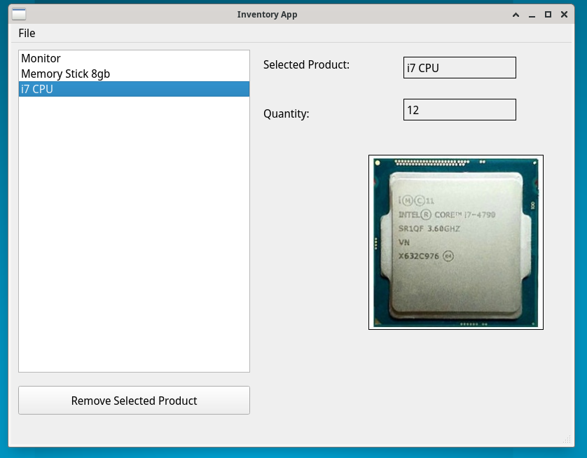
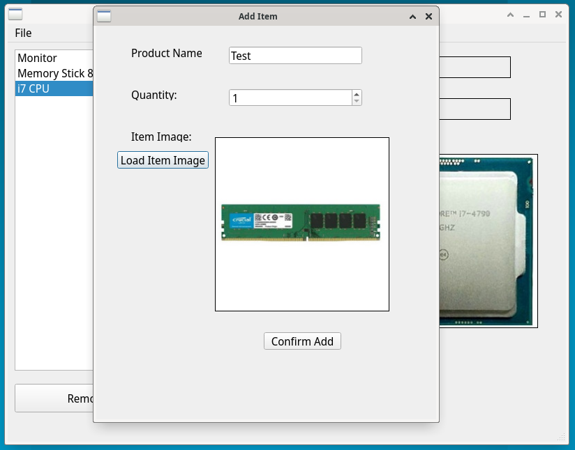

# Qt Inventory Control Desktop App 

## Windows:

### Main Window:

- Displays a (possibly empty) list of items

- Display the selected product name, quantity and image 

- Have a remove item button

- Have a submenu with:
	
	- New product

	- Edit Selected Product

	- Save Products

	- Load Products

	- Edit

### Add Item Window

- Enter product name

- Enter product quantity

- Load image 

- Confirm item button

### Update Item Window

- Update quantity

- Load item image

- Confirm edit button

